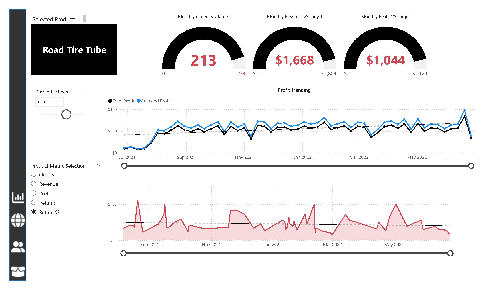

# AdventureWorks Sales Dashboard

## Overview
This Power BI dashboard provides comprehensive analytics for AdventureWorks, a bicycle and accessories retailer. The dashboard visualises sales performance, product analysis, geographic distribution, and customer insights from 2020-2022.

## Business Problem Addressed
I created this dashboard to address several key business challenges:
- Tracking sales performance across multiple product categories and geographic regions
- Understanding customer purchasing patterns and segmentation
- Analysing product return rates and identifying quality issues
- Monitoring key performance indicators against targets
- Providing actionable insights for sales and marketing teams

## Key Features

### Sales Performance Analytics
- Total Revenue: $24.9M
- Total Profit: $10.5M
- Total Orders: 25.2K
- Return Rate: 2.2%
- Monthly tracking of revenue, orders, and returns with month-over-month comparisons
- Revenue trending analysis with trendlines

### Product Analysis
- Top 10 products by orders and revenue
- Return rate analysis by product
- Product category breakdown (Accessories: 17K, Bikes: 13.9K, Clothing: 7K)
- Product metrics selection for custom analysis
- Price adjustment simulation capabilities
  

### Geographic Sales Distribution
- Interactive world map showing sales by country
- Regional filters (Europe, North America, Pacific)
- Country-level sales performance

### Customer Insights
- 17.4K unique customers with $1,431 average revenue per customer
- Customer segmentation by income level (Low, Average, High)
- Customer segmentation by occupation (Professional, Skilled Manual, Management)
- Top 100 customers by revenue
- Customer trending analysis over time

### Performance Tracking
- KPI gauges for monthly orders, revenue, and profit vs targets
- Profit trending with adjusted profit analysis
- Interactive filters and slicers for deep-dive analysis

## Technical Implementation

### Data Sources
I integrated 11 different data tables:
- Primary fact tables (Sales Data, Returns Data)
- Product dimension tables (Product Lookup, Categories, Subcategories)
- Customer and Territory lookup tables
- Calendar table for time intelligence
- Reference tables for parameter selections

### Data Model
I built the dashboard on a comprehensive star schema model with:
- Sales and Returns as fact tables
- Dimension tables for Products, Customers, Territory, and Calendar
- Additional lookup and reference tables for metrics selection and price adjustments

For full data model documentation, see [Data Model Documentation](./documentation/data-model.md).

### DAX Measures
I developed sophisticated DAX measures including:
- Complex revenue and profit calculations using SUMX iterations
- Time intelligence functions for period-over-period analysis
- Filter context manipulation for segmented analysis
- Parameter-driven calculations for what-if scenarios

For details on my DAX implementation, see [Key DAX Measures](./documentation/key-dax-measures.md).

## Screenshots
- [Main Dashboard](./screenshots/Exec_dashboard.png)
- [Geographic Analysis](./screenshots/Map_view.png)
- [Product Performance](./screenshots/Product_detail.png)
- [Customer Analysis](./screenshots/Customer_detail.png)

## Additional Documentation
- [Data Sources and ETL Process](./documentation/data-sources.md)
- [Key DAX Measures](./documentation/key-dax-measures.md)
- [Data Model Documentation](./documentation/data-model.md)

---

*Note: The actual data sources have been anonymised and only the Power BI model structure is shared.*
